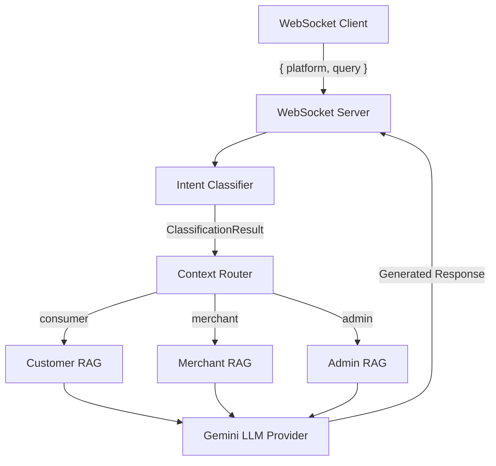

# Shopcard AI Chat Service — Phase 1 Walkthrough

## Architecture Overview

The system implements a **single AI chat service** with **three isolated knowledge contexts** (Consumer, Merchant, Admin), connected via **WebSocket**. The full pipeline:

```
WebSocket → IntentClassifier → ContextRouter → RAG Module → LLM → Response
```



---

## Project Structure

```
e:\testrag\
├── data/
│   ├── customer/         # Consumer knowledge base (3 docs)
│   │   ├── orders.txt
│   │   ├── refunds.txt
│   │   └── shopping_faq.txt
│   ├── merchant/         # Merchant knowledge base (3 docs)
│   │   ├── onboarding.txt
│   │   ├── products.txt
│   │   └── store_management.txt
│   └── admin/            # Admin knowledge base (3 docs)
│       ├── monitoring.txt
│       ├── procedures.txt
│       └── workflows.txt
├── src/
│   ├── classifier/
│   │   └── IntentClassifier.ts    # Rule-based intent classification
│   ├── llm/
│   │   ├── BaseLLMProvider.ts     # Provider abstraction interface
│   │   └── GeminiProvider.ts      # Gemini SDK implementation
│   ├── rag/
│   │   ├── BaseRAGModule.ts       # RAG module interface
│   │   ├── LocalDocumentStore.ts  # Keyword-based document search
│   │   ├── CustomerRAG.ts         # Consumer domain RAG
│   │   ├── MerchantRAG.ts         # Merchant domain RAG
│   │   └── AdminRAG.ts            # Admin domain RAG
│   ├── router/
│   │   └── ContextRouter.ts       # Routes queries to correct RAG
│   ├── server/
│   │   └── WebSocketServer.ts     # WebSocket endpoint + pipeline orchestration
│   ├── index.ts                   # Entry point
│   └── test_client.ts             # Automated integration test client
├── .env                           # ⚠️ Set your GEMINI_API_KEY here
├── .env.example
├── package.json
└── tsconfig.json
```

---

## Component Details

### 1. Intent Classifier — [IntentClassifier.ts](file:///e:/testrag/src/classifier/IntentClassifier.ts)

- **Strategy Pattern** — `ClassificationStrategy` interface allows swapping rule-based for ML/LLM classification without architectural changes
- **Rule-Based Strategy (Phase 1)** — Keyword matching with multi-word bonus scoring
- **Platform-locked routing** — Consumer queries always → `customer_rag`, Merchant → `merchant_rag`, Admin → `admin_rag`
- **Intent categories**: refunds, orders, shopping, account, support (consumer) | onboarding, product_management, store_management, customer_handling (merchant) | user_management, content_moderation, monitoring, workflows, disputes (admin)

### 2. Context Router — [ContextRouter.ts](file:///e:/testrag/src/router/ContextRouter.ts)

- Registry pattern — RAG modules register by name
- Routes `ClassificationResult.targetRAG` → correct `BaseRAGModule.retrieve()`
- **Strict isolation** — Consumer queries never access Merchant/Admin knowledge

### 3. RAG Modules — [BaseRAGModule.ts](file:///e:/testrag/src/rag/BaseRAGModule.ts)

Three independent modules, each with isolated document collections:

| Module | Data Directory | Domain |
|--------|---------------|--------|
| [CustomerRAG](file:///e:/testrag/src/rag/CustomerRAG.ts) | `data/customer/` | Shopping, refunds, orders, consumer FAQs |
| [MerchantRAG](file:///e:/testrag/src/rag/MerchantRAG.ts) | `data/merchant/` | Products, onboarding, store management |
| [AdminRAG](file:///e:/testrag/src/rag/AdminRAG.ts) | `data/admin/` | Monitoring, procedures, workflows |

- **[LocalDocumentStore](file:///e:/testrag/src/rag/LocalDocumentStore.ts)** — Loads `.txt` files, splits into sections, performs TF-based keyword relevance scoring
- Designed for future upgrade to vector embeddings without changing the `BaseRAGModule` interface

### 4. LLM Abstraction — [BaseLLMProvider.ts](file:///e:/testrag/src/llm/BaseLLMProvider.ts)

- Pure interface abstraction — system never imports a concrete SDK directly
- **[GeminiProvider](file:///e:/testrag/src/llm/GeminiProvider.ts)** — Google Generative AI SDK implementation
- Future providers (OpenAI, Claude, Grok) only need to implement `BaseLLMProvider`
- Platform-aware system prompts set per request

### 5. WebSocket Server — [WebSocketServer.ts](file:///e:/testrag/src/server/WebSocketServer.ts)

- Full pipeline orchestration: parse → classify → route → retrieve → generate → respond
- Input validation with clear error messages
- Welcome message on connection

**Message Protocol:**

```json
// Client → Server
{ "platform": "consumer", "query": "How do refunds work?" }

// Server → Client
{
  "status": "success",
  "platform": "consumer",
  "intent": "refunds",
  "ragSelected": "customer_rag",
  "confidence": 0.75,
  "response": "Based on our policy...",
  "sources": ["refunds.txt"],
  "provider": "gemini",
  "model": "gemini-2.0-flash",
  "timestamp": "2026-06-13T12:00:00.000Z"
}
```

---

## Validation Results

### TypeScript Compilation
✅ **Zero errors** — `npx tsc --noEmit` passes cleanly

### Server Startup
✅ **All components initialize successfully:**
- 3 document stores loaded (3 docs each = 9 total)
- 3 RAG modules registered
- Intent Classifier with RuleBasedStrategy
- WebSocket server listening on `ws://localhost:8080`

---

## How to Run

### 1. Set your Gemini API key

Edit [.env](file:///e:/testrag/.env) and replace `your_gemini_api_key_here` with your actual key:

```
GEMINI_API_KEY=AIza...your_real_key
```

### 2. Start the server

```bash
npm run dev
```

### 3. Test with the automated test client

In a separate terminal:

```bash
npm run test:client
```

This sends 9 test queries (3 per platform) and validates correct RAG routing.

### 4. Manual testing with Postman

1. Open Postman → New → WebSocket Request
2. Connect to `ws://localhost:8080`
3. Send a JSON message:

```json
{ "platform": "consumer", "query": "How do refunds work?" }
```

```json
{ "platform": "merchant", "query": "How do I add a product?" }
```

```json
{ "platform": "admin", "query": "How do I monitor system health?" }
```
